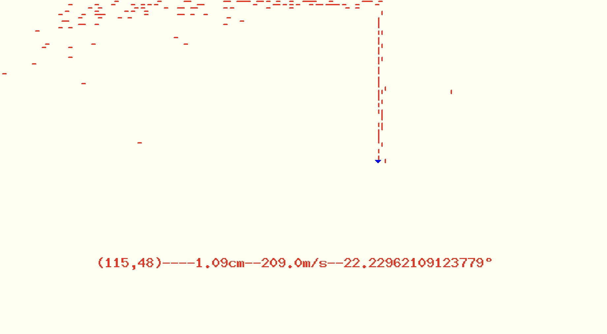

# <h1> <strong> Filtre de Kalman et filtre de Kalman étendu</strong> </h1>

---

<h2> Principe de fonctionnement</h2>

---

Le filtre de Kalman permet de faire du tracking d'un objet mobile avec un outil ou capteur qui donne sa position de façon récurrente. En effet, on part du principe que les informations fournies par le capteur peuvent être quelques fois de mauvaises qualitées car bruitées. Ainsi, le filtre Kalman garantit une meilleure suivie de l'objet. Pour ce faire, le filtre prend en compte les principes physiques du déplacement du mobile pour estimer la position futur dont il fait une pondération avec les informations fournies par le capteur, ce qui force est de constater améliore la suivie de l'objet. Et dans l'eventualité où il considère que les informations fournies par le capteur sont très bruitées il accordera plus de poids à son inférence, et dans le cas contraire à ceux du capteur.

# <h2> Condition d'utilsation du filtre de Kalman</h2>

---

<ul>
    <li> <em>Avoir un outil de perception du monde réel</em> </li>
    <li> <em>La présence de bruits affecte la précision des outils </em> </li>
</ul>
 Pour ne pas dépendre uniquement des capteurs du robot le filtre de Kalman se sert des connaissances physiques sur le mouvement du mobile pour ajuster les mesures du capteur.

# <h2> Différence entre le filtre de kalman et <strong>le filtre de Kalman étendu </strong> </h2>

---

Le filtre de Kalman Standard est en mesure de prédire l'état d'un système ou le mouvement d'un mobile uniquement lorsque les équations physiques qui sous-tendent ce mouvement sont linéaires. On parle <strong> filtre de Kalman étendu</strong>(EKF) quand les équations ne sont pas linéaire on passe par une phase  de linéarisation de ceux avant la phase de prédiction 

# <h2> Les différentes étapes du fonctionnement du filtre de Kalman étendu (EKF)</h2>

----

### 1. **Initialisation**:
    
   On considère que le EKF intervient à un instant $(k \ne 0)$. Dans l'éventualité où $k$ correspond à l'instant 1 on peut estimer l'état initial c'est-à-dire l'état à l'instant 0.
    

 

### 2. **Prédiction**:

  On prédit l'état à l'instant $k+1$ à partir de l'état à l'instant $k$ et des informations sur le mouvement du mobile: 
  
  $$\hat{x}_{k+1}= A_{k}x_{k}+B_{k}u_{k}+v_{k}$$
   
   
   * $x_{k},x_{k+1}$: **l'état à l'instant $k$, l'état à l'instant $k+1$**
   
   **$A_{k}$** : exprime comment l'état du système passe de $k$ à $k+1$ lorsqu'aucune commande de contrôle n'est
     exécutée. Il est construit à partir des équations physiques du mouvement du mobile. **C'est une matrice carré
     d'ordre la dimension de l'état(ou le nombre de paramètres qui constituent un état).**
   
   * $B_{k}$: exprime comment l'état du système passe de $k$ à $k+1$ à cause des commandes. Il est aussi déduit des équations physiques du mouvement du mobile. **C'est une matrice dont le nombre de lignes est égal au nombre d'états et le nombre de colonnes est égal au nombre d'entrées de contrôle(ou commandes).**
   
   * $u_{k}$: est le vecteur de commande ou contrôle, il matérialise les effets du contrôle ou des commandes sur le mobile. **C'est un vecteur de taille le nombre de contrôle**
   
   * $v_{k}$: exprime un bruit qu'on simule de sorte à ressembler au bruit réel qu'on peut avoir. **Il est dimension le nombre d'états**

### 3. **Mise à jour de la covariance**: 

   $$P_{k+1|k}=A_{k+1}P_{k|k}A^{T}_{k+1}+Q_{k+1}$$

   * $P_{k+1|k}$: est la matrice de covariance à l'instant $k+1$ sachant la matrice de covariance à l'instant $k$. **C'est une matrice d'ordre le nombre d'état(ou paramètres d'états)**.
   
   * $P_{k|k}$:la matrice de covariance à l'instant $k$ avec les informations à l'instat $k$ ou **matrice de covariance à postériori**
   
   * $Q_{k+1}$: représente l'écart entre l'état rèel et l'estimation. Lorsque les valeurs de $Q$ sont grandes cela signifie que nous faisons plus confiance à nos observations de capteurs réelles qu'au mesures prédites. **$Q$ est une matrice carrée d'ordre le nombre d'états(ou paramètres d'états)**

### 4. **Innovation**:

$$h(\hat{x}_{k+1|k})=H_k\hat{x}_{k+1|k}+w_k$$

L'innovation est: $$\overline{y}_{k+1}=z_{k+1}-h(\hat{x}_{k+1|k})$$

* $y_{k}$: la mesure résiduelle

* $H_k$: la matrice de mesure à l'instant $k$, il permet d'estimer les mesures du capteur à partir de l'estimation de l'état à l'instant $k$($\hat{x}_{k+1|k}$). **C'est une matrice dont le nombre de ligne est égal au nombre de paramètres observés par le capteur et le nombre de colonnes est égal au nombre d'états.**

* $w_k$: le vecteur de bruit à l'instant $k$. **Il est de dimension le nombre de paramètres observés par les capteurs**

* $z_k$: les mesures réelles  effectuées par les capteurs.

### 5. **Covariance d'innovation**:

$$s_{k+1}=H_{k+1}P_{k+1|k}H^{T}_{k+1}+R_{k+1}$$ 

* $R_{k+1}$: bruit du capteur,si les mesures du capteurs sont sûres $diag(R_{k+1})->0$, **c'est une matrice d'ordre le nombre de mesures de capteurs**. 

### 6. **Gain optimal**:

$$K_{k+1}=P_{k+1|k}H^{T}_{k+1}S^{-1}_{k+1}$$

Le gain indique dans qu'elle mesure l'état et la covariance des prévisions d'état doivent être corrigés à la suite des nouvelles mesures réelles du capteur ($z_k$).

### 7. **Estimation à postériori de l'état**:

$$\hat{x}_{k+1|k}=\hat{x}_{k+1|k}+K_{k+1}\overline{y}_{k+1}$$

### 8. **Estimation à postériori de la covariance**:

$$P_{k+1|k+1}=(I-K_{k}H_{k})P_{k+1|k}$$

La covariance du mobile après avoir intégrer les informations venant des capteurs.

# **Les variables à initialiser dans le filtre de Kalman**

---

Les variables à initialiser lors d'une implémentation du filtre de Kalman sont:  **$$x_{k}, A_{k}, v_{k}, B_{k}, P_{k|k}, H_k,  w_k, Q_{k+1} ,𝑅_{𝑘+1}$$**

# **Exemple d'application du filtre de Kalman**

---

Références:

**https://automaticaddison.com/extended-kalman-filter-ekf-with-python-code-example/** Kalman étendu

